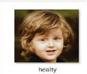

**A Deep Learning Approach for Diagnosis of Down’s Syndrome on Image Data**  

***Vaibhav Pise 1\*, Hissamuddin Hannure2, Niyamat Chaudhari 3, Prachi Mahajan4, Pushpi Rani5** 1\*Dept. of Computer Engineering, G H Raisoni College of Engineering and Management, Pune, India E-Mail: vaibhavlspise2001@gmail.com* 

*2,3,4,5Dept. of Computer Engineering, G H Raisoni College of Engineering and Management, Pune, India* 

**ABSTRACT** 

Approximately 6-8% of the global population is affected by rare genetic disorders. Unfortunately, many of these conditions lack comprehensive genetic testing solutions because the specific genetic variants responsible for them remain unidentified, except for some well-documented disorders like Down  syndrome.  Down  syndrome  is  a  prevalent  genetic  disorder  in  humans,  arising  from chromosomal abnormalities. In this paper, we explore the application of deep learning techniques in the legal field, particularly in the context of image data analysis. To achieve this, we leverage a method known as "transfer learning," which enables us to harness pre-trained models that have already acquired valuable features and then fine-tune them to suit our specific objectives in the realm of legal document review. 

1. **INTRODUCTION** 

Rare genetic disorders affect approximately 8% of the global population, significantly impacting their overall quality of life and well-being. Accurate diagnosis is paramount as it provides vital insights that go beyond mere symptom observation [1]. Research indicates that around 30-40% of genetic  disorders  manifest  with  changes  in  facial  and  cranial  structure.  Employing  computer- assisted  tools  utilizing  image  processing  and  machine  learning  techniques  can  simplify  the identification of facial dysmorphic features linked to genetic syndromes. These tools operate by precisely identifying facial landmarks and extracting measurements from images, streamlining 

the task of identifying structural abnormalities associated with these syndromes [2]. 

Convolutional  Neural  Networks  (CNNs)are  akin  to  potent  tools  for  deciphering  images, revolutionizing the field of computer vision by their remarkable contributions. Their efficacy is primarily attributable to their hunger for abundant examples to learn from [1,3]. In this research paper,  we  eschew  the  ubiquitous  ResNet50  architecture,  opting  instead  for  a  novel  and straightforward approach. We employed Transfer Learning with the VGG19 model. 

` `This strategy entails the fine-tuning of the final layers of the VGG19 model [2]. Robust neural network  models  have  been  cultivated  through  extensive  training  data  and  substantial computational resources. These models have achieved noteworthy accuracy rates in arduous tasks such  as  categorizing  images  and  detecting  objects  [4].  Moreover,  the  application  of  transfer  learning methods has shown to be highly beneficial. It allows us to leverage the knowledge amassed by these advanced models and apply it across a wide spectrum of tasks spanning diverse domains, facilitating the resolution of multifarious challenges within the realm of computer vision [1,5]. 

The subsequent sections of the paper are outlined as follows: Section 1.2 provides an overview of the literature review. The methodology and data sets used in this paper are discussed in section 1.3. Section 1.4 presents the result evaluation followed by conclusion in section 1.5. 

2. **LITERATURE SURVEY** 

In the study conducted by Zhao and colleagues [2], a novel approach for the detection of Down syndrome  using  face  images  or  photographs  is  introduced.  This approach brings together two crucial elements: geometric features derived from local texture features (LTF) and anatomical landmarks acquired through applying the Contourlet transform. The classification task is carried out using a Support Vector Machine (SVM) classifier, distinguishing between individuals with Down syndrome and those without. This integrated approach yielded impressive results, achieving an accuracy rate of 97.92%, surpassing methods that exclusively relied on either geometric or texture features. 

Subhiksha Ramanathan and team's research [5] aims to probabilistically detect Down's Syndrome using  machine  learning.  They  utilize  Optical  Character  Recognition  (OCR)  to  extract  key attributes from prenatal screening reports, including nuchal translucency, crown rump length, age, and more. Clustering methods like K-medoids, K-means, DBSCAN, and hierarchical clustering are used for handling unlabeled data. To combat data imbalance, Adaptive Synthetic Sampling Approach (ADASYN) is employed.  

Under the guidance of Bosheng Qin [6], a group of researchers has created an automated technique employing deep neural networks to identify Down syndrome from 2D RGB facial images. The approach involves preprocessing the images, training a generic facial recognition network, and fine-tuning an identification network specifically designed for Down syndrome. 

From  above  literature  survey  we  conclude  that  introduce  innovative  approaches  to  Down syndrome detection, each accompanied by unique constraints and avenues for future research. Zhao's facial photograph analysis achieves impressive accuracy but is hampered by a restricted dataset and challenges in adapting to real-world conditions. Subhiksha Ramanathan's analysis of prenatal screening reports grapples with data size and handling issues, opening possibilities for enhanced  data  adaptability  and  cross-ethnic  comparisons.  Bosheng  Qin's  deep  neural  network method, which relies on 2D RGB facial images, encounters limitations due to a small dataset and the  importance  of  optimizer  selection,  underlining  the  need  for  data  expansion,  optimization strategies, and feature exploration. These studies collectively offer promising directions for early Down syndrome detection and personalized healthcare, urging further research to overcome their specific limitations and bolster their capabilities. 

Researchers led by Pushkar [12] presents a framework of deep learning for identify developmental disorders, particularly focusing on their detection from facial images. The authors have designed a novel model using. Deep Convolutional Neural Networks (DCNN) used to extract features and gathered a fresh dataset containing images of individuals with diverse developmental disorders. The model we put forward underwent testing across various age groups and individual disabilities, with a comparison to a human intelligence-based model. The outcomes indicate that our model surpasses human intelligence, achieving an impressive accuracy of 98.80%. 

The  paper  underscores  the  significance  of  leveraging  computer  vision  and  deep  learning techniques  for  early  diagnosis  of  developmental  disorders.  It  sheds  light  on  the  potential applications of these models in public settings, such as airports and restaurants, to address the unique needs of individuals with such disorders. Furthermore, the document suggests potential directions  for  future  research  in  the  domain,  such  as  investigating  deep  learning  models  for diagnosing  and  detection  of  disorders  using  audio-visual  or  depth  data  and  a  more  extensive examination of disabilities with larger datasets. Essentially, the research highlights the efficacy of deep learning in detecting developmental disorders and its potential for meaningful, real-world applications. 

` `In  the  study  conducted  by  kurt  and  colleagues  [13],  Down  syndrome  is  a  prevalent  genetic condition caused by trisomy 21 and is characterized by distinct physical features, including a round face with slight flattening at the back of the head, slanting eyes, and a small mouth with a larger tongue. This condition, which affects about 1 in 800 infants, has seen a significant increase in life expectancy, from 25 in 1983 to 60 today. Recognizing Down syndrome from facial images holds promise for applications in public spaces such as airports and security centers, where it can be used to detect individuals with Down syndrome, alerting the system or security to potential unique needs. Moreover, it can serve as an initial step in the broader context of using facial images to identify various medical abnormalities. A brief overview of literature is presented in table 1.1. 

`                                        `**TABLE 1.1:**  Literature survey overview 

|Author |Title |Methodology used |Limitations |
| - | - | - | - |
|Zhao et al. [2] |Down  Syndrome Detection  from  Facial Photographs  using Machine  Learning Techniques |` `Geometric  features  and  local  texture features extracted from  facial  photographs,  Support  Vector Machine (SVM). |
- Restricted dataset. 

- Challenges  in adapting  to  real- world conditions. 
|
|Ramanathan et al. [5] |Probabilistic Determination  of Down’s  Syndrome Using  Machine Learning Techniques |Naive  Bayes,  Random  forest,  Artificial  Neural  Network  (ANN). |￿  Data  size  and handling issues. |
|Qin et al. [6] |Automatic Identification  of  Down Syndrome Using Facial Images  with  Deep Convolutional  Neural Network |Deep  Convolutional  Neural  Network  (DCNN)  with  optimizer  like  Adam,  SGDM,etc. and method like K  nearest Neighbour (KNN)  |
- Small dataset.  

- Importance  of optimizer selection 
|
|Pushkar et al. [12] |A deep learning frame- work  for  recognizing developmental disorders |
Binary  Statistical  Image  Features  (BSIF), Principal

Component  Analysis  (PCA),

GIST. 
|
- Small dataset 

- Need for more data to improve accuracy
|

|||||
| :- | :- | :- | :- |
|Kurt et al, [13] |Down  syndrome recognition  using  local binary  patterns  and statistical evaluation of the system |Local  Binary  Pattern  (LBP)  and SVM. |
- Data  size  and handling issues 

- Cross-ethnic comparisons 
|
3. **METHODOLOGIES** 

This section introduces the methods that we have used in this paper.** 

**1.3.1 Transfer Learning** 

Convolutional  neural  networks  (CNNs)  are  usually  trained  through  the  back-propagation algorithm,  a  process  that  involves  iteratively  adjusting  the  network's  weights  and  biases  to minimize a pre-defined cost function. [2,4]. 

We have started from scratch, the initial weights are randomly set, and this can pose challenges when  working  with  a  small  training  dataset,  making  it  prone  to  issues  like  overfitting  and underfitting  [2].  In  such  scenarios,  transfer  learning  emerges  as  a  more  effective  approach. Transfer learning involves utilizing a pre-trained neural network with weights that have already learned  valuable  features  and  characteristics  from  a  different,  larger  dataset,  while  sharing  a similar architecture. In this process, only the final fully connected (FC) layers are fine-tuned using the available training data, adapting the network's representations to the specific features of our dataset  [5].  Consequently,  we  can  leverage  the  knowledge  acquired  by  established  network architectures to address our problem, benefiting from their previously demonstrated success in similar tasks. 

1. **ResNet-50 Model** 

ResNet-50 is a deep architecture with 50 layers, and it is known for its smart shortcuts that help with learning [2]. In transfer learning with ResNet-50, we grab a pre-trained model, typically trained on ImageNet, and then we do some custom work on the final layers to make them perfect for our specific task. It is like taking a great foundation and adding the final touches to suit our needs [4]. 

2. **InceptionV3 Model** 

InceptionV3 is a creation from Google, and it is great at looking at images in various ways to capture different details. For transfer learning with InceptionV3, we usually start with pre-trained models that have seen a lot of data, often from large datasets [2]. Then we fine-tune the last layers to make them work for our task. It is akin to adapting a versatile tool to do a specific job just the way we want it [2]. 

These models allow us to leverage pre-existing knowledge and fine-tune them for our unique tasks, saving us a lot of time and resources while benefiting from their expertise [6]. 

3. **VGG16 Model** 

VGG16 is quite like VGG19; it is like its close sibling. It has 16 layers, with 13 dedicated to understanding images and 3 for making sense of everything. For transfer learning with VGG16, we did something similar [2,4]. We take a VGG16 model that is already learned a lot from ImageNet, and then we make some adjustments to the final layers to align it with our specific task. It is a bit like customizing a well-designed room to make it fit your style [4]. 

4. **VGG19 Model** 

VGG19 is a popular choice due to its simplicity and effectiveness. It is like a 19-layer cake with 16 layers  for  understanding  image  features  and  3  layers  for  making  sense  of  it  all  [4,5].  This architecture is fantastic at picking out important aspects in images as shown in figure 1.1. When it comes to transfer learning with VGG19, we borrow some pre-trained knowledge from a VGG19 model that has been well-trained on ImageNet, a big dataset [6]. We start with those pre-trained weights and then tweak the final layers to make the model fit our specific task. It is like using a ready-made foundation and redecorating the house to suit our taste while keeping the essential structure [7]. 

`                                         `**FIGURE 1.1**: VGG19 Architecture 

**1. 3.2 DATASET** 

The Life database comprises 3,000 images categorized into two classes: children with Down's syndrome  and  healthy  children  as  shown  in  figure  1.2.  These  images  exhibit  variations  in resolution, poses, and lighting conditions [4]. To ensure data quality, two different types were enforced for all images: both eyes must be visible and properly oriented, and the face should be clearly shown and visible. An expert physician, DRF, meticulously reviewed and validated every image to ensure accurate syndrome diagnosis [2]. Images that could not meet these criteria or type were eliminated. 

 

**FIGURE** **1.2**: A glimpse from dataset 

A  significant  hurdle  in  the  medical  realm  is  the  limited  availability  of  data.  To  tackle  this challenge,  supplementary  images  were  obtained  from  sources  such  as  Google  Images  and integrated into specific categories. In order to ensure equilibrium and enhance the dataset's quality, augmentation techniques were employed on the underrepresented classes within the training set. These techniques included horizontal rotation, zooming, and shearing operations, while ensuring that each image continued to display clear faces [2,4,7]. 

Furthermore,  to  facilitate  model  training  and  consistency,  all  images  were  resized  to  a  fixed dimension  of  224x224x3 before  being  fed into the  VGG19  model  [2,4].  This  standardization allows for effective deep learning model training, even with variations in the original images [2,4]. 

4. **RESULTS AND EVALUATION** 
1. **VGG19 Model Result** 

Leave-one-out validation was independently carried out on the two datasets. The outcomes were evaluated based on accuracy (ACC), precision (PR), and recall (RC). Additionally, the Area Under the Curve (AUC) of the Receiver Operating Characteristic (ROC) was calculated for each image in dataset. The results are given in table 1.2. 

`  `**TABLE 1.2:** ACC, Validation Accuracy, AUC, PR and RC of VGG19 Model. 

|Model |***ACC*** |***Validation Accuracy*** |***AUC*** |***PR*** |***RC*** |
| - | - | :- | - | - | - |
|VGG19 |99\.9% |`     `80.2% |`  `100% |`  `99.9% |100% |

Figure 1.3 represents the Training accuracy and AUC, Precision and Recall of VGG19 Model. 

From the figure at epoch one accuracy is 0.76 and other classification metrics like AUC is 0.83, Precision is 0.77 and Recall is 0.75. For the last epoch the accuracy is 0.99 and other classification metrics like AUC, Precision and Recall is 1.0, 0.99 and 1.00 repetitively. 

`          `**FIGURE 1.3**. Training accuracy and AUC, Precision and Recall of VGG19 Model. 

2. **Comparison of models** 

Comparisons of VGG19 model with other transfer learning models are presented in this section. Table 1.3 shows the comparison results of all the transfer learning model. Furthermore, we have compared VGG19 model with other model existing in literature, the results are shown in table 1.4.  

VGG19 stands out as a top-performing model, achieving an impressive 99.6% accuracy, nearly flawless precision, and recall. The Combined (Geometric and Texture) method also displays strong performance  with  a  97.9%  accuracy,  although  it  shows  a  somewhat  lower  recall  rate  [2].  In contrast, Naïve Bayes, Random Forest, SVM-RBF, and k-NN exhibit lower accuracy scores, along with variable precision and recall metrics [6,8]. It is worth noting that precise precision and recall values for Naïve Bayes, Random Forest, and SVM-RBF are not computed (NC), and AUC values were not reported for SVM-RBF and k-NN. 

**TABLE 1.3**: Comparison of transfer learning models in terms of training size, top accuracy, and validation accuracy with other trained models. 

|Model |***Training Size*** |***Top Accuracy*** |***Validation Accuracy*** |
| - | - | - | :- |
|VGG19 |3000 |99\.9% |` `81.7% |
|VGG16 |3000 |97\.9% |` `81.2% |
|InceptionV3 |3000 |93\.3% |85\.3% |
|Resnet50 |3000 |76\.6% |65\.1% |

**TABLE 1.4**: Comparison of model with existing models. 

|Model/Method |***Accuracy*** |***Precision*** |***recall*** |***AUC*** |
| - | - | - | - | - |
|VGG19 |0\.996 |0\.999 |`    `1.000 |`    `1.000 |
|Combined  (Geometric and Texture) [2] |0\.979 |1\.000 |0\.958 |` `0.996 |
|Naïve Bayes [6] |0\.926 |NC |NC |NC |
|Random Forest [6] |0\.735 |NC |NC |NC |
|SVM-Radial  Basis Function(RBF) [8] |0\.946 |0\.933 |0\.955 |NC |
|k-NN [8] |0\.902 |0\.889 |0\.909 |NC |
|Geometric  distance  + PCA+Linear discriminant  analysis (LDA)+SVM [9] |0\.9839 |NC |NC |NC |
|LBP(PCA)+SVM(poly nomial,3-rd degree)[10] |0\.990 |0\.996 |0\.984 |NC |
|GIST + SVM [11] |0\.928 |NC |NC |NC |

\*NC=Not Computed. 

5. **CONCLUSION** 

Rare genetic disorders affect a significant portion of the world's population, and many of these conditions lack thorough genetic testing solutions because we  have not identified the specific genetic variants responsible for them. While some disorders like Down syndrome have received attention, there is still much to discover in the realm of rare genetic disorders. This paper has delved into the potential of using deep learning techniques in the legal field, especially when it comes to analysing image data. We have been able to do this through a method known as "transfer learning," which allows us to take advantage of pre-trained models with valuable features and adapt them to the specific needs of legal document review. By using deep learning and transfer learning, we have made significant progress in improving the efficiency and accuracy of legal document analysis. This approach has the potential to make the document review process in the legal profession more efficient, which is crucial because lawyers often must go through a massive number of documents with great care. As technology continues to evolve and integrate into various fields, the use of deep learning in the legal sector presents exciting possibilities and solutions. Further research and development in this area may lead to innovative tools that can enhance legal document analysis, ultimately improving legal practices in the future. 

**KEYWORDS** 

***Genetic Diseases, Transfer Learning, Classification, Deep Learning.*** 

**REFERENCES** 

1. Abhishek Singh, Dakshina Ranjan Kisku, “Detection of Rare Genetic Diseases using Facial 2D Images with Transfer Learning”, Eighth International Symposium on Embedded Computing and System Design (ISED) 2018. 
1. Qian  Zhao,  Kenneth  Rosenbaum,  Raymond  Sze,  Dina  Zand, Marshall  Summar,  Marius George Linguraru “Down Syndrome Detection from Facial Photographs using Machine Learning Techniques” IEEE International Conference 2019. 
3. Alex Krizhevsky, Ilya Sutskever, and Geoffrey E. Hinton , “ImageNet Classification with Deep Convolutional Neural Networks”[ Communications of the ACM ](https://dl.acm.org/toc/cacm/2017/60/6),[ Volume 60,Issue 6 ](https://dl.acm.org/toc/cacm/2017/60/6), June 2017. 
3. Nathaniel Huber-fliflet, Fusheng Wei, Haozhen Zhao, Han Qin, Shi Ye, Amy Tsang. “Image Analytics for Legal Document Review: A Transfer Learning Approach.”  Journal of Medical Imaging 4(4), 044008 (Oct–Dec 2017). 
3. Omkar M. Parkhi, Andrea Vedaldi, Andrew Zissermanhishek Singh, Dakshina Ranjan Kisku “Deep Face Recognition” Visual Geometry Group Department of Engineering Science University of Oxford, British Machine Vision Conference, 2015.  
3. Subhiksha  Ramanathan,  Sangeetha  M,  Saachi  Talwai,  Dr.  Natarajan  S  “Probabilistic Determination Of Down’s Syndrome Using Machine Learning Techniques” 2018 International Conference on Advances in Computing, Communications and Informatics (ICACCI). 
3. Bosheng  Qin,  Letian  Liang,  Jingchao  Wu,  Qiyao  Quan,  Zeyu  Wang  and  Dongxiao  Li “Automatic  Identification  of  Down  Syndrome  Using  Facial  Images  with  Deep  Convolutional Neural Network.” Diagnostics 2020, 10, 487 
3. Qian Zhao, Kenneth Rosenbaum, Kazunori Okada, Dina J. Zand, Raymond Sze, Marshall Summar,  and  Marius  George  Linguraru  “Automated  Down  Syndrome  Detection  using  Facial Photographs\*.”  35th Annual International Conference of the IEEE EMBS Osaka, Japan, 3 - 7 July, 2013.  
3. Jadisha Yarif Ramírez Cornejo, Helio Pedrini, Ariane Machado-Lima, Fátima de Lourdes dos Santos Nunes, “Down syndrome detection based on facial features using a geometric descriptor” J. Med. Imag. 4(4), 044008 (2017) 
3. Dima, V., Ignat, A., Rusu, C. (2018). Identifying Down Syndrome Cases by Combined Use of Face Recognition Methods” SOFA 2016. Advances in Intelligent Systems and Computing, vol 634. Springer  
3. Ankush Mittal, Hardik Gaur and Manish Mishra, “Detection of Down Syndrome Using Deep  Facial  Recognition”  Third  International  Conference  on  Computer  Vision  and  Image Processing (CVIP 2018) 
12. Pushkar Shukla, Tanu Gupta, Aradhya Saini, Priyanka Singh, Raman Balasubramanian,” A deep learning framework for recognizing developmental disorders” 2017 IEEE Winter Conference on Applications of Computer Vision 
12. Kurt Burçin , Nabiyev V. Vasif “ Down syndrome recognition using local binary patterns and  statistical  evaluation of  the  system” [ Expert  Systems  with  Applications ](https://www.sciencedirect.com/journal/expert-systems-with-applications)[Volume  38,  Issue 7,](https://www.sciencedirect.com/journal/expert-systems-with-applications/vol/38/issue/7) July 2011 
